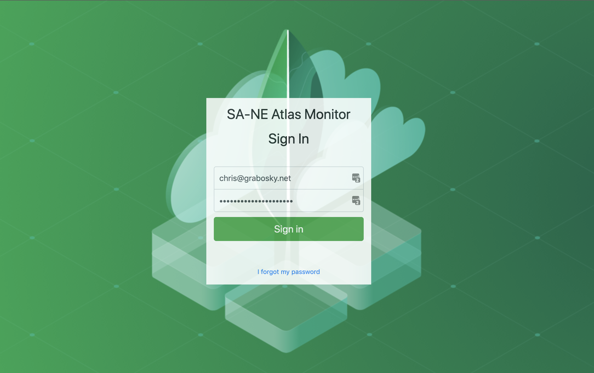
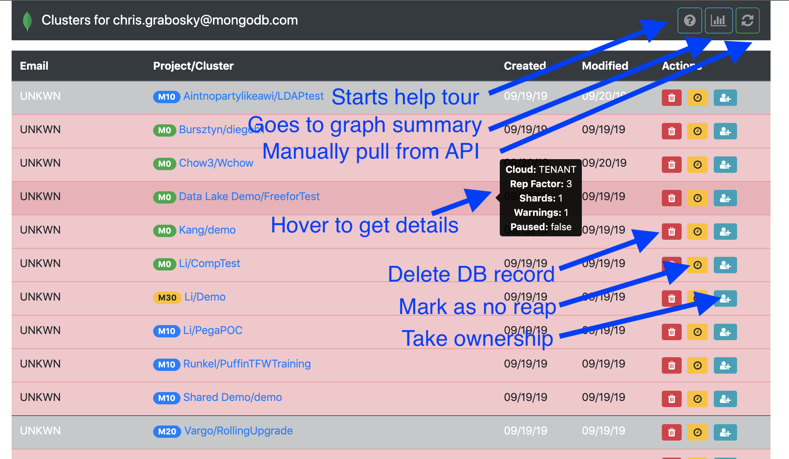
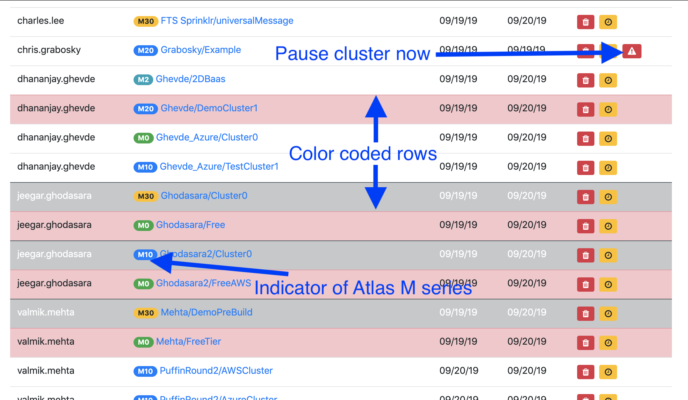
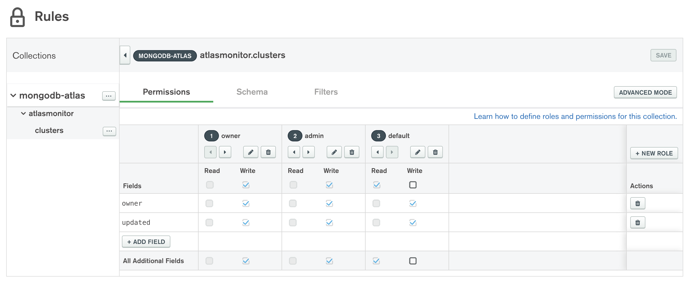

# Atlas Monitor

## Background
This is a utility that crawls a specific MongoDB Atlas Org, enters all of that log data into a MongoDB Atlas cluster, which triggers events to parse that. Regular cron jobs then look at that parsed data to see which clusters should be "reaped" or "paused" based on user input.

There is a simple UI to power that.

## Screenshots

The UI is labeled:
* Refresh button at top pulls new clusters it finds from Atlas API
* Trash can deletes DB record of cluster (not terminating the cluster)
* The clock will toggle whether the cluster should be auto-reaped. Default is it will be auto reaped (`noReap:false`)
* The person is visible on unclaimed clusters. This changes the `owner` field to your info
* the warning triangle will immediately pause the cluster 
* Cells that are white will not be auto realed (`noReap:false`)
* Cells that are yellow are in a warning state
* Cells that are red means that cluster will be reaped tomorrow
* Cells that are black means the system paused that cluster

## Code explanation
### Database
Database used is the `atlasmonitor` database. In it is the `log` collection which gets filled every day with the output of Atlas API calls, triggers run against that to create the `clusters` collection which is used for the UI and business decisions, and if any cluster is paused or deleted, an entry for that API call is made in the `changelog` collection. The `clusters` collection does have a unique index put on  `project:1,name:1` for the project and cluster friendly names.

### Stitch
In the `Stitch-Export` folder is the export of the stitch app that uses the following code:

* `generateDailyUserLog` is called daily at 2 am to poll the org logs, iterate over every project, find all clusters, and put that data as one document in the `log` collection
* `updateMasterList` is called on insert of the `log` collection to iterate over each of the found clusters and insert them into `clusters` with basic meta data. That collection has a unique index
* `ageYesterday` gets called daily at 1 am to increment the `warnings` field in the `cluster` document for all documents with `noReap:false` (or other words, not protected)
* `reap` is called on update of the `clusters` collection and if the `warnings` exceeds 2, it will pause the cluster. _NOTE THAT THIS LOGIC IS COMMENTED OUT RIGHT NOW FOR ONBOARDING PURPOSES_
* `pauseCluster` is called by the above `reap` function when it should pause a cluster
* `isValidAdmin` is a function which tracks which user IDs are admin

Authentication is done with email/password auth within Stitch.

An HTTP Service called `hook` is done to make the http calls to the Atlas API.

Rules are set up so:
* the `owner` can insert/delete `{"owner.id": "%%user.id"}`
* the `admin` can modify `{"%%true": {"%function": {"name": "isValidAdmin", "arguments": [ "%%user"]}}}`
* the `default` can view or take ownerhsip `{}`

Secrets are:
* `validAdmins` is a `string[]` of Admin UIDs
* `orgID` is the Atlas Org's GUID
* `atlasAPI` is an object with the scoped API keys: `{"key": "name","secret": "abc-def-ghi-123-456"}

Hosting is enabled and the `Stitch-Hosting` directory is uploaded there.

### HTML
In the `Stitch-Hosting` folder is the HTML files which:

* `index.html` is the login page
* `clusters.html` uses Query Anywhere to build a list from the `clusters` collection and lets you modify the `noReap` flag to prevent reaping or pause the cluster right there by calling `reap` Stitch function
* `conf/conf.js` holds global constants 
* The `reset.html`, `signup.html`, `emailregistration.html` handle new user sign ups for Stitch Authentication